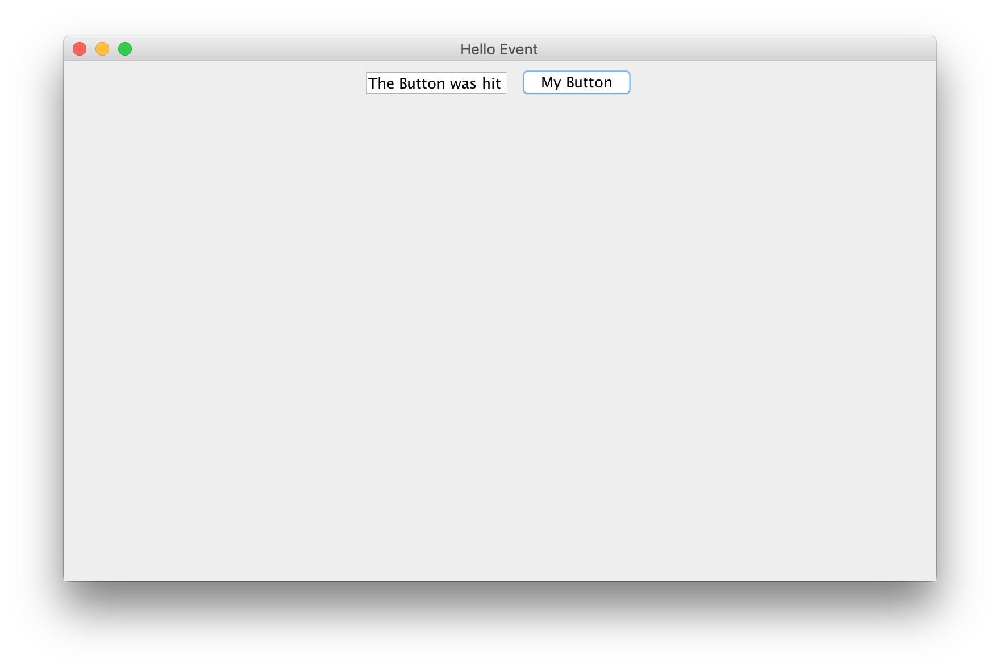

# Java_SwingDemo

## 059 `JFrame` 的作用是什么，它应该如何使用？

```java
package com.lightwing.main;

import javax.swing.*;

public class HelloJFrame {
    public static void main(String[] args) {
        JFrame jFrame = new JFrame("Hello, Swing");
        // When the window is closed, do some respond
        jFrame.setDefaultCloseOperation(WindowConstants.EXIT_ON_CLOSE);
        jFrame.setSize(768, 480);
        jFrame.setVisible(true);

        JLabel label = new JLabel();
        label.setText("Hello, this is one label");
        jFrame.add(label);
    }
}
```


### 答案

JFrame 是 Swing 创建视窗的一个基础类，它像一个容器一样，可以包含其它的组件类，是其它组件赖以生存的对象。使用步骤如下：

1. 用 `new` 语句创建 `JFrame` 对象，可以通过构造方法传入视窗标题参数；
2. 设置窗口关闭时的行为，一般是结束进程；
3. 设置视窗的外观，例如：尺寸、是否可见与否等；
4. 为窗口添加其它组件，例如：标签、按钮等；
5. 如需要，可以添加一些事件，例如：`WindowsListener` 等。

## 060 如何创建一个按钮？

```java
package com.lightwing.main;

import javax.swing.*;
import java.awt.*;

public class HelloJButton {
    public static void main(String[] args) {
        JFrame jFrame = new JFrame("Hello, Swing Button");
        // When the window is closed, do some respond
        jFrame.setDefaultCloseOperation(WindowConstants.EXIT_ON_CLOSE);
        jFrame.setSize(768, 480);
        jFrame.setVisible(true);
        jFrame.setLayout(new FlowLayout());

        JButton btn = new JButton("My Button");
        jFrame.add(btn);
    }
}
```


### 答案

在 Swing 程序中，一般使用 `JButton` 类来定义按钮组件，它的使用思路如下：

1. 用 new 语句创建 JButton 对象，可以通过构造方法传入文本参数；
2. 把创造好的 JButton 对象加入到容器组件，例如：JFrame；
3. 必要时添加一些事件，例如：`ActionListner`。

## 061 如何使用文本输入控件？

```java
package com.lightwing.main;

import javax.swing.*;
import java.awt.*;

public class HelloJTextField {
    public static void main(String[] args) { // Main Method()
        JFrame jf = new JFrame("Hello, Text");
        jf.setLayout(new FlowLayout());

        // adding a new text field
        JTextArea jTextArea = new JTextArea(5, 10);
        jTextArea.setText("Type something here...");
        jf.add(jTextArea);
        showMe(jf);
    }

    private static void showMe(JFrame jf) {
        // Setting response when the window is shut down
        jf.setDefaultCloseOperation(WindowConstants.EXIT_ON_CLOSE);
        jf.setSize(768, 480);
        jf.setVisible(true);
    }
}
```


#### 答案

`JTextField`, 单行输入

`JTextArea`, 多行输入

## 062 如何捕获事件？

```java
package com.lightwing.main;

import javax.swing.*;
import java.awt.*;

public class HelloEvent {
    // to create a object of TextArea
    private static JTextField jTextField = new JTextField(10);

    public static void main(String[] args) {
        JFrame jFrame = new JFrame("Hello Event");
        jFrame.setLayout(new FlowLayout());

        // adding a new text area
        jFrame.add(jTextField);

        // adding a button to the window
        JButton jButton = new JButton("My Button");
        jFrame.add(jButton);
        jButton.addActionListener(e -> HelloEvent.jTextField.setText("The Button was hit"));
        showMe(jFrame);
    }

    private static void showMe(JFrame jf) {
        // Setting response when the window is shut down
        jf.setDefaultCloseOperation(WindowConstants.EXIT_ON_CLOSE);
        jf.setSize(768, 480);
        jf.setVisible(true);
    }
}
```



#### 答案

使用注册监听器的方式捕获事件：

1. 创建组件对象，如 `JButton`；
2. 创建实现了监听器接口或继承自适配器的实现类，实现需要进行相应动作的抽象方法；
3. 调用组件对象的 `add___Listener()` 方法，为该组件添加某监听器。

## 063 如何使用 BorderLayout 布局

```java
package com.lightwing.main;

import javax.swing.*;
import java.awt.*;

public class HelloBorderLayout {
    public static void main(String[] args) {
        JFrame jFrame = new JFrame("BorderLayout Test");
        jFrame.setLayout(new BorderLayout());
        jFrame.add(new JButton("east"), BorderLayout.EAST);
        jFrame.add(new JButton("center"), BorderLayout.CENTER);
        jFrame.add(new JButton("south"), BorderLayout.SOUTH);
        jFrame.add(new JButton("north"), BorderLayout.NORTH);
        jFrame.add(new JButton("west"), BorderLayout.WEST);

        jFrame.setSize(768, 480);
        jFrame.setVisible(true);
        jFrame.setDefaultCloseOperation(WindowConstants.EXIT_ON_CLOSE);
    }
}
```


#### 答案

向容器组件 `add()` 添加即可

## 064 如何使用 `FlowLayout` 布局

```java
package com.lightwing.main;

import javax.swing.*;
import java.awt.*;

public class HelloFlowLayout {
    public static void main(String[] args) {
        JFrame jFrame = new JFrame("Hello, FlowLayout");
        jFrame.setLayout(new FlowLayout());

        for (int i = 0; i < 10; ++i) {
            jFrame.add(new JButton(i + ""));
        }

        jFrame.setSize(768, 480);
        jFrame.setVisible(true);
        jFrame.setDefaultCloseOperation(WindowConstants.EXIT_ON_CLOSE);
    }
}
```


#### 答案

`setLayout()`

## 065 如何使用 `GridLayout` 布局

```java
package com.lightwing.main;

import javax.swing.*;
import java.awt.*;

public class HelloGridLayout {
    public static void main(String[] args) {
        JFrame jFrame = new JFrame("Hello, GridLayout");
        GridLayout gridLayout = new GridLayout(10, 10);
        jFrame.setLayout(gridLayout);

        for (int i = 0; i < 100; jFrame.add(new JButton("" + i++))) ;

        jFrame.setSize(768, 480);
        jFrame.setVisible(true);
        jFrame.setDefaultCloseOperation(WindowConstants.EXIT_ON_CLOSE);
    }
}
```


## 068 用 `JButton` 开发扫雷游戏

```java
package com.lightwing.main;

import javax.swing.*;
import java.awt.*;
import java.awt.event.ActionEvent;
import java.awt.event.ActionListener;
import java.awt.event.MouseAdapter;
import java.awt.event.MouseEvent;
import java.util.Arrays;
import java.util.Random;

public class Mine extends JPanel implements ActionListener {
    private static int width = 30;
    private static int height = 16;
    private static int frameWidth = 690;
    private static int frameHeight = 370;
    private static int[][] board = new int[height][width];
    private static int[][] onOffBoard = new int[height][width];
    private static int[] template = {-1, 0, 1};
    private static Timer secondsTimer;
    private static int startX = 20;
    private static int startY = 110;
    private static boolean firstClick = true;
    private static boolean gameOver = false;
    private static Color buttonColorChange = Color.LIGHT_GRAY;
    private static String buttonFace = ":)";
    private static int numBombsLeft = 99;
    private static int secondsCounter = 0;

    private Mine() {
        for (int i = 0; i < height; i++) {
            Arrays.fill(onOffBoard[i], 1);
        }
        Timer timer = new Timer(1000 / 30, this);
        timer.start();
        ActionListener taskPerformer = evt -> secondsCounter++;
        secondsTimer = new Timer(1000, taskPerformer);

    }

    private static void makeBoard(int y, int x) {
        for (int i = 0; i < height; i++) {
            Arrays.fill(board[i], 0);
        }
        int K = 99; // number of mines
        Random rand = new Random();
        int templateIndex1;
        int templateIndex2;

        while (--K > 0) {
            if (K == 0)
                break;
            int rand1 = rand.nextInt(16);
            int rand2 = rand.nextInt(30);
            if (board[rand1][rand2] == 9) { // if mine is already there extend loop
                K++;
                continue;
            }
            if (rand1 == y && rand2 == x) { // if mine is chosen on first click
                K++;
                continue;
            }

            board[rand1][rand2] = 9; // plant mine
            for (int index1 = 0; index1 < 3; index1++) { // set the numbers around mine
                for (int index2 = 0; index2 < 3; index2++) {
                    templateIndex1 = template[index1];
                    templateIndex2 = template[index2];

                    try {
                        int pos = board[rand1 + templateIndex1][rand2 + templateIndex2];
                        if (pos != 9) {
                            board[rand1 + templateIndex1][rand2 + templateIndex2] = pos + 1;
                        }
                    } catch (java.lang.ArrayIndexOutOfBoundsException ignored) {
                    }
                }
            }
            System.out.println(board[y][x]);
        }
    }

    public static void main(String args[]) {
        JFrame frame = new JFrame("Minesweeper");
        frame.setLayout(new BorderLayout());
        Mine game = new Mine();
        frame.add(game, BorderLayout.CENTER);
        frame.addMouseListener(new MouseAdapter() {
            public void mouseClicked(MouseEvent e) {
                if (!gameOver) {
                    if (e.getX() >= startX + 10 && e.getX() <= (startX + 10) + frameWidth) {
                        if (e.getY() >= startY + 35 && e.getY() <= startY + 35 + frameHeight) {
                            int x = (e.getX() - startX - 11) / 23;
                            int y = (e.getY() - startY - 36) / 23;
                            if (e.getButton() == MouseEvent.BUTTON3) {
                                if (onOffBoard[y][x] == 2) {
                                    onOffBoard[y][x] = 1;
                                    numBombsLeft += 1;
                                } else {
                                    if (onOffBoard[y][x] != 0) {
                                        onOffBoard[y][x] = 2;
                                        numBombsLeft -= 1;
                                    }
                                }
                            } else {
                                if (onOffBoard[y][x] != 2) {
                                    if (firstClick) {
                                        secondsTimer.start();
                                        board[y][x] = 0;
                                        do {
                                            makeBoard(y, x);
                                        } while (board[y][x] != 0);
                                        firstClick = false;
                                    }

                                    if (board[y][x] != 9) {
                                        expand(y, x);
                                    } else {
                                        secondsTimer.stop();
                                        buttonFace = "X(";
                                        gameOver();
                                    }
                                }
                            }
                        }
                    }
                }
                hasWon();
            }
        });

        frame.addMouseListener(new MouseAdapter() {
            public void mousePressed(MouseEvent e) {
                if (e.getX() >= 350 && e.getX() <= 400) { // over the game button
                    if (e.getY() >= 70 && e.getY() <= 120) {
                        buttonColorChange = Color.GRAY;
                        gameOver = false;
                        firstClick = true;
                        secondsCounter = 0;
                        secondsTimer.start();
                        for (int i = 0; i < height; i++)
                            Arrays.fill(onOffBoard[i], 1);
                    }
                }

                if (!gameOver)
                    if (e.getX() >= startX + 10 && e.getX() <= (startX + 10) + frameWidth)
                        if (e.getY() >= startY + 35 && e.getY() <= startY + 35 + frameHeight)
                            buttonFace = ":o";
            }

            public void mouseReleased(MouseEvent e) {
                if (!gameOver) {
                    buttonColorChange = Color.LIGHT_GRAY;
                    buttonFace = ":)";
                }
            }
        });
        frame.setVisible(true);
        int windowWidth = 750;
        int windowHeight = 600;
        frame.setSize(windowWidth, windowHeight);
        frame.setDefaultCloseOperation(WindowConstants.EXIT_ON_CLOSE);
    }

    private static void gameOver() {
        gameOver = true;
        for (int i = 0; i < height; i++)
            for (int j = 0; j < width; j++)
                if (board[i][j] == 9)
                    onOffBoard[i][j] = 0;
    }

    private static void hasWon() {
        int blankCounter = 0;
        for (int i = 0; i < height; i++) {
            for (int j = 0; j < width; j++)
                if (onOffBoard[i][j] == 0)
                    blankCounter++;
        }
        if (blankCounter == 382) {
            buttonFace = "B)";
            gameOver();
        }
    }

    private static void expand(int cellY, int cellX) {
        try {
            if (board[cellY][cellX] == 0 && onOffBoard[cellY][cellX] == 1) {
                onOffBoard[cellY][cellX] = 0;
                expand(cellY + 1, cellX);
                expand(cellY - 1, cellX);
                expand(cellY, cellX + 1);
                expand(cellY, cellX - 1);
                expand(cellY + 1, cellX + 1);
                expand(cellY - 1, cellX - 1);
                expand(cellY - 1, cellX + 1);
                expand(cellY + 1, cellX - 1);
            } else if (onOffBoard[cellY][cellX] == 1) {
                onOffBoard[cellY][cellX] = 0;
            }
        } catch (java.lang.ArrayIndexOutOfBoundsException e) {
            System.out.println("Error");
        }
    }

    public void paint(Graphics g) {
        g.setColor(Color.WHITE);
        g.fillRect(startX, startY, frameWidth, frameHeight);
        for (int i = 0; i < height; i++) {
            for (int j = 0; j < width; j++) {
                if (onOffBoard[i][j] == 1) {
                    g.setColor(Color.BLACK);
                    g.fillRect(startX + j * 23, startY + i * 23, 22, 22);
                } else if (onOffBoard[i][j] == 0) {
                    if (board[i][j] == 9 && !buttonFace.equals("B)")) {
                        g.setColor(Color.RED);
                    } else {
                        g.setColor(Color.LIGHT_GRAY);
                    }
                    g.fillRect(startX + j * 23, startY + i * 23, 22, 22);
                    g.setColor(Color.BLACK);
                    g.setFont(new Font("Courier", Font.PLAIN, 14));
                    if (board[i][j] != 9)
                        g.drawString(Integer.toString(board[i][j]), startX + 8 + j * 23, startY + 15 + i * 23);
                    else
                        g.drawString("B", startX + 8 + j * 23, startY + 15 + i * 23);
                } else {
                    g.setColor(Color.GREEN);
                    g.fillRect(startX + j * 23, startY + i * 23, 22, 22);
                }
                g.setColor(buttonColorChange);
                g.fillRect(350, 30, 50, 50);
                g.setColor(Color.BLACK);
                g.drawString(buttonFace, 365, 55);
                g.fillRect(150, 30, 70, 50);
                g.fillRect(530, 30, 70, 50);
                g.setColor(Color.WHITE);
                g.setFont(new Font("Courier", Font.PLAIN, 24));
                g.drawString(Integer.toString(numBombsLeft), 175, 55);
                g.drawString(Integer.toString(secondsCounter), 555, 55);
            }
        }
    }

    public void actionPerformed(ActionEvent e) {
        repaint();
    }
}
```


#### 答案

逻辑要点：

1. JFrame 的创建和使用；
2. 分布问题，推荐使用 `GridLayout` 布局管理器；
3. 事件的捕捉，监听左右键；
4. 渲染窗口和显示。

## 069 用 JTextField 和 JButton 开发计算器程序

```java
package com.lightwing.main;

import javax.swing.*;
import java.awt.*;
import java.awt.event.ActionEvent;
import java.awt.event.ActionListener;

public class Calculator extends JFrame implements ActionListener {
    private static final long serialVersionUID = -1717806291593500805L;
    private JTextField t1, t2, t3;
    private JButton b1, b2, b3, b4;

    private Calculator() {
        setTitle("iCalculator");
        JLabel l1 = new JLabel("Operand");
        JLabel l2 = new JLabel("Operand");
        JLabel l3 = new JLabel("Result");
        t1 = new JTextField(10);
        t2 = new JTextField(10);
        t3 = new JTextField(10);
        // 将窗口物体放入窗口
        GridBagLayout layout = new GridBagLayout();
        getContentPane().setLayout(layout);
        addComponent(layout, l1, 1, 0);
        addComponent(layout, l2, 2, 0);
        addComponent(layout, l3, 3, 0);
        addComponent(layout, t1, 1, 1);
        addComponent(layout, t2, 2, 1);
        addComponent(layout, t3, 3, 1);

        b1 = new JButton("+");
        b2 = new JButton("-");
        b3 = new JButton("*");
        b4 = new JButton("/");
        addComponent(layout, b1, 1, 2);
        addComponent(layout, b2, 1, 3);
        addComponent(layout, b3, 2, 2);
        addComponent(layout, b4, 2, 3);
        b1.addActionListener(this);
        b2.addActionListener(this);
        b3.addActionListener(this);
        b4.addActionListener(this);
        this.pack();
        setDefaultCloseOperation(WindowConstants.EXIT_ON_CLOSE);
    }

    @Override
    public void actionPerformed(ActionEvent j) {
        double n;
        try {
            if (j.getSource() == b1) {
                double n1, n2;
                n1 = Double.parseDouble(t1.getText());
                n2 = Double.parseDouble(t2.getText());
                n = n1 + n2;
                t3.setText(String.valueOf(n));
            }
            if (j.getSource() == b2) {
                double n1, n2;
                n1 = Double.parseDouble(t1.getText());
                n2 = Double.parseDouble(t2.getText());
                n = n1 - n2;
                t3.setText(String.valueOf(n));
            }
            if (j.getSource() == b3) {
                double n1, n2;
                n1 = Double.parseDouble(t1.getText());
                n2 = Double.parseDouble(t2.getText());
                n = n1 * n2;
                t3.setText(String.valueOf(n));
            }
            if (j.getSource() == b4) {
                double n1, n2;
                n1 = Double.parseDouble(t1.getText());
                n2 = Double.parseDouble(t2.getText());
                n = n1 / n2;
                t3.setText(String.valueOf(n));
            }
        } catch (Exception ignored) {
        }
    }

    // 快捷使用 GridBagLayout 的方法
    private void addComponent(GridBagLayout layout, Component component, int row, int col) {
        GridBagConstraints constraints = new GridBagConstraints();
        constraints.fill = GridBagConstraints.BOTH;
        constraints.insets = new Insets(10, 2, 10, 2);
        constraints.weightx = 100;
        constraints.weighty = 100;
        constraints.gridx = col;
        constraints.gridy = row;
        constraints.gridwidth = 1;
        constraints.gridheight = 1;
        layout.setConstraints(component, constraints);
        if (component instanceof JButton) {
            ((JButton) component).addActionListener(this);
        }
        getContentPane().add(component);
    }

    // initialize and display the window 
    public static void main(String[] args) {
        Calculator calc = new Calculator();
        calc.setVisible(true);
    }
}
```


#### 答案

1. 按钮的创建和使用；
2. 使用 GridLayout 布局管理器；
3. 事件捕捉；
4. 窗口的渲染和显示。